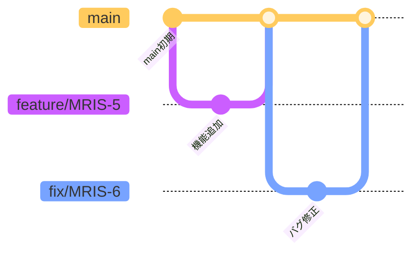

# ChatBot BE

## プロジェクト概要

このプロジェクトは、社内手続き関連のPDFやWordファイルなどをアップロードし、その内容に基づいて質問応答が可能なチャットボットを構築するAPIです。

アップロードされたドキュメントは分割・Embeddingされ、ベクトルDB（FAISS）に格納されます。ユーザーからの質問に対してはRAGにより、根拠付きの自然な回答を提供します。

---


## 環境構築手順

### 1. リポジトリをクローン

以下は **SSH を使用した場合の例** です。HTTPS を使用する場合は GitHub 上でリポジトリのクローン用 URL を変更してください。

```bash
git clone git@github.com:novel-muraguchi/chatbot-be.git
cd chatbot-be
```

---

### 2. `.env` ファイルを作成

ルートディレクトリに `.env` ファイルを作成してください。
`.env.example` を用意していますので、以下のコマンドでコピーしてから必要に応じて値を編集してください。

```bash
cp .env.example .env
```

---

### 3. Docker 環境を構築・起動

```bash
docker compose up -d
```

---

### 4. FastAPI のドキュメントを確認

ブラウザで以下のURLにアクセスし、Swagger UI が表示されることを確認します。

```
http://localhost:8000/docs
```

---

## GitHub ブランチ運用ルール

### ブランチ一覧と役割

#### `main`
- **概要**：本番環境にデプロイされる安定版コード
- **使用タイミング**：リリース確定時

#### `feature/*`
- **概要**：新機能の開発用ブランチ。通常は`main`ブランチから分岐し、開発が完了したら`main`にマージされる。
- **使用タイミング**：機能実装時

#### `fix/*`
- **概要**：バグ修正用ブランチ。PRのマージ後にバグがあった場合、修正を行うためのブランチ。
- **使用タイミング**：バグ修正時

---

### ブランチ命名規則

```
feature/チケット番号
fix/チケット番号
```

#### 例:
- `feature/MRIS-5`
- `fix/MRIS-5`

---

### 使用ルール

#### 運用フロー



#### PR作成ルール
- PRのタイトルに JIRA のチケット番号を含める（例: `[MRIS-5] xxxxxxxx`）
- PRテンプレートに従って概要・影響範囲を記述
- 他者レビューを必ず経由すること

---

### タスクに対するブランチの使用方法

- 各タスクに対して1ブランチを作成
- 作業が完了したら `main` にマージする

---

### 禁止事項

- `main` ブランチに直接 push しない
- 未レビューのコードを merge しない
- 命名規則に従わないブランチ作成

---

### 例外

- 今回のプロジェクトでは developやrelease ブランチは使用せず、feature/* や fix/* などの作業ブランチから main へ直接マージする方針とする

---

