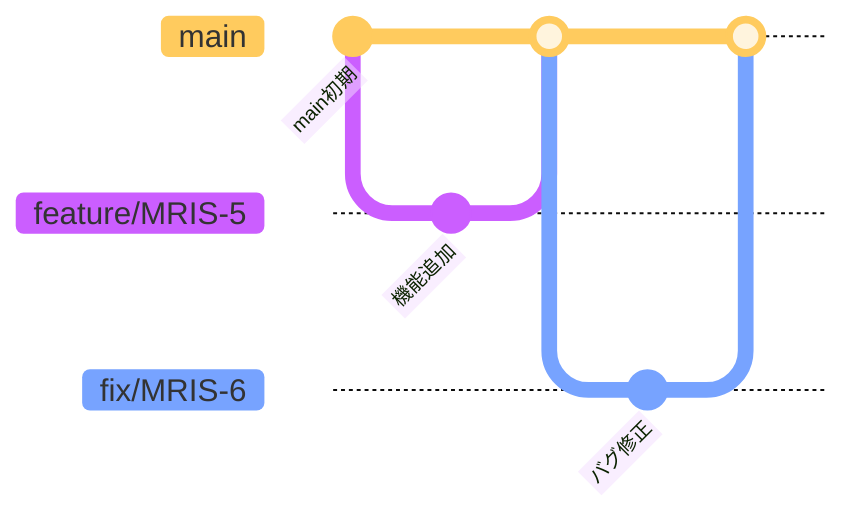

# ChatBot BE

## プロジェクト概要

本プロジェクトは、社内手続き関連のPDFやWordファイルなどをアップロードし、その内容に基づいて質問応答が可能なチャットボットを構築するAPIである。

アップロードされたドキュメントは分割・Embeddingされ、ベクトルDB（FAISS）に格納される。ユーザーからの質問に対してはRAGにより、根拠付きの自然な回答を提供する。

---


## 環境構築手順

### 1. リポジトリをクローン

以下は **SSH を使用した場合の例** です。HTTPS を使用する場合は GitHub 上でリポジトリのクローン用 URL を変更すること。

```bash
git clone git@github.com:novel-muraguchi/chatbot-be.git
cd chatbot-be
```

---

### 2. `.env` ファイルを作成

ルートディレクトリに `.env` ファイルを作成する。
`.env.example` を用意しているため、以下のコマンドでコピーしてから必要に応じて値を編集すること。

```bash
cp .env.example .env
```

---

### 3. Docker 環境を構築・起動

```bash
docker compose up -d
```

---

### 4. FastAPI のドキュメントを確認

ブラウザで以下のURLにアクセスし、Swagger UI が表示されることを確認する。

```
http://localhost:8000/docs
```

---


## Linter / Formatter - Ruff

本プロジェクトではPythonのコード整形および静的解析ツールとして**Ruff**を使用している。

### Ruff を使用する目的

- PEP8 準拠のコードスタイルチェック（pycodestyle）
- 未使用変数などの検出（pyflakes）
- インポート順序の整理（isort）
- バグになりうるパターンの検出（bugbear）
- 冗長な構文の簡素化（simplify）
- 型アノテーションの確認（annotations）
- 自動修正可能（`--fix`）

---


### 初期セットアップ手順

#### 1. Poetry 仮想環境を作成 & 依存関係インストール

```bash
poetry install
```

> `ruff` は `[tool.poetry.group.dev.dependencies]` に開発用依存として含まれている。

#### 2. 仮想環境を有効化（任意）

```bash
poetry shell
```

※ `poetry shell` コマンドが無効な場合は、以下を使用する：

```bash
# 仮想環境をアクティブにするためのコマンドを出力
poetry env activate

# 上記の出力をコピーしてシェル上で実行することで、仮想環境がアクティブになる。
# 例：
source /Users/yourname/chatbot-be/.venv/bin/activate

```

---

### CLI での Ruff 実行方法

```bash
# コードチェックのみ実行
ruff check .

# 自動修正も含めて実行
ruff check . --fix
```
> 仮想環境に入らずに実行する場合は、先頭に `poetry`をつけて実行すること。

---

## テストの実行方法

本プロジェクトでは、pytest を使用してテストを実行している。

```bash
# 以下のコマンドでテストを実行
poetry run pytest
```

### 補足
- テストコードは tests/ ディレクトリに配置する。
- ディレクトリ構成は api/ と同様に構成し、対応するファイルを同じ階層に持たせる。
  - 例：src/chatbot_be/api/v1/healthcheck.py → tests/api/v1/test_healthcheck.py

---

## GitHub ブランチ運用ルール

### ブランチ一覧と役割

#### `main`
- **概要**：本番環境にデプロイされる安定版コード
- **使用タイミング**：リリース確定時

#### `feature/*`
- **概要**：新機能の開発用ブランチ。通常は`main`ブランチから分岐し、開発が完了したら`main`にマージされる。
- **使用タイミング**：機能実装時

#### `fix/*`
- **概要**：バグ修正用ブランチ。PRのマージ後にバグがあった場合、修正を行うためのブランチ。`main`ブランチから分岐し、修正完了後は `main`ブランチにマージされる。
- **使用タイミング**：バグ修正時

---

### ブランチ命名規則

```
feature/チケット番号
fix/チケット番号
```

#### 例:
- `feature/MRIS-5`
- `fix/MRIS-5`

---

### 使用ルール

#### 運用フロー



#### PR作成ルール
- PRのタイトルに JIRA のチケット番号を含める（例: `[MRIS-5] xxxxxxxx`）
- PRテンプレートに従って概要・影響範囲を記述
- 他者レビューを必ず経由すること

---

### タスクに対するブランチの使用方法

- 各タスクに対して1ブランチを作成
- 作業が完了したら `main` にマージする

---

### 禁止事項

- `main` ブランチに直接 push しない
- 未レビューのコードを merge しない
- 命名規則に従わないブランチ作成

---

### 例外

- 本プロジェクトでは developやrelease ブランチは使用せず、feature/* や fix/* などの作業ブランチから main へ直接マージする方針とする

---

